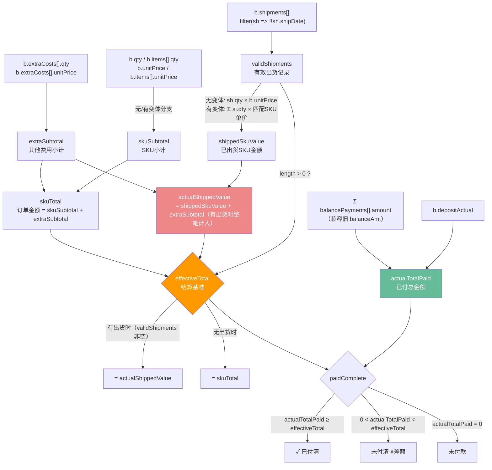
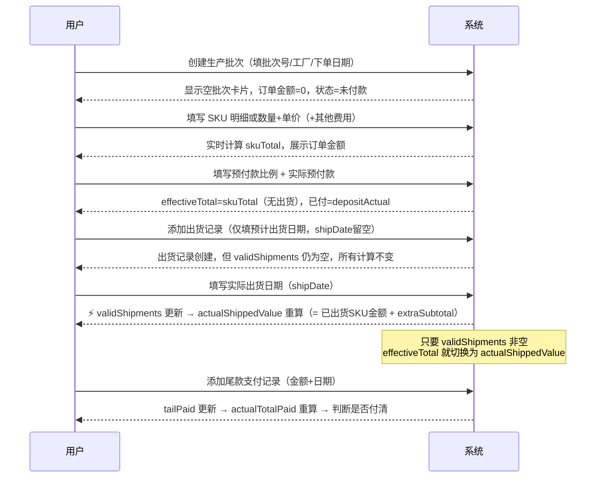
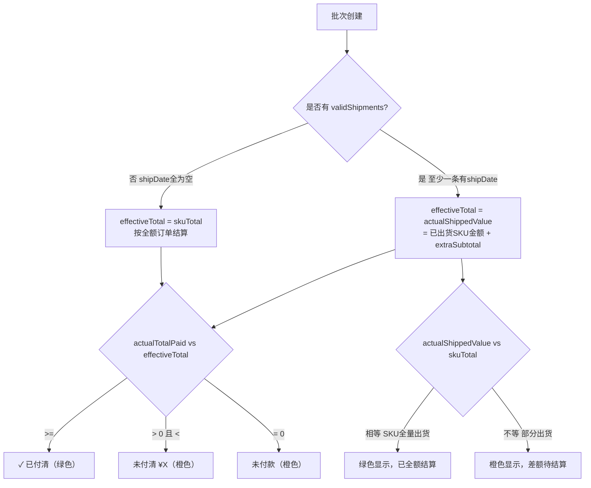
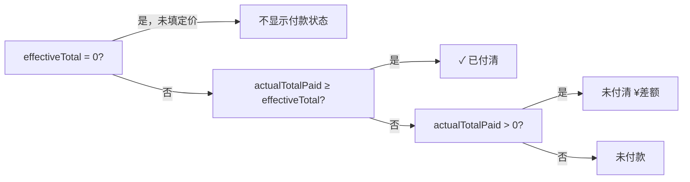

# 生产出货模块 — 技术深度文档

> **适用范围**：`生产出货` Tab → `下单生产` 阶段（STAGES[9]）  
> **核心文件**：`src/features/detail/index.tsx` → `TabProd` 组件（约 408-930 行）  
> **状态管理**：`src/context/ProductContext.tsx` → 9 个专用 update 函数  
> **数据持久化**：SQLite `products` 表 JSON blob，经由 PUT `/api/products` 乐观锁同步

---

## 1. 模块定位

生产出货是整个 FBA 开发流程中**数据结构最复杂、计算链最深**的模块。它承载了从工厂下单到货物到达 FBA 仓库之间的完整资金流和物流流追踪，核心目标是回答三个问题：

1. **钱付了多少？** — 定金 + 尾款多笔支付的实际总额
2. **货发了多少？** — 已填实际出货日期的出货记录对应数量
3. **账结清了吗？** — 实际已付 vs 应结金额（含出货后的动态切换）

---

## 2. 数据模型

### 2.1 数据层次结构

```
Product
└── stages.production: StageData
    ├── status / startDate / endDate     ← 阶段级字段
    └── batches: Batch[]                 ← 生产批次列表

Batch
├── id / batchNo / factory
├── orderDate / expectedShip
├── qty / unitPrice                      ← 无变体时使用
├── depositPct / depositActual / depositDate
├── balancePct / balanceAmt* / balanceDate*   ← *旧字段，已被 balancePayments 替代
├── note / status
├── items: BatchItem[]                   ← SKU 明细（有变体时使用）
├── extraCosts: ExtraCost[]              ← 其他费用
├── shipments: Shipment[]                ← 出货记录
└── balancePayments: BalancePayment[]    ← 尾款支付记录（多笔）

BatchItem
└── id / variantId / variantName / qty / unitPrice

ExtraCost
└── id / name / qty / unitPrice

Shipment
├── id / status
├── expectedShip / shipDate              ← ⚠️ shipDate 是"生效开关"
├── qty                                  ← 无变体时使用
├── items: ShipmentItem[]                ← 有变体时使用
├── method / carrier / tracking
├── fbaShipId / etaDate / note
└── items[]: { id, variantId, variantName, qty }

BalancePayment
└── id / amount / date / shipmentRef / note
```

### 2.2 关键字段说明

| 字段 | 类型 | 说明 | 注意事项 |
|---|---|---|---|
| `b.qty` | number | 无变体时的总下单数量 | 有变体时此字段无效，用 `items[].qty` 之和 |
| `b.unitPrice` | number | 无变体时的单价 | 有变体时此字段无效，各 SKU 有独立单价 |
| `b.depositPct` | number | 预付款比例 (%) | 用于计算理论预付款，不影响实付判断 |
| `b.depositActual` | number | **实际**支付的预付款金额 | 影响 `actualTotalPaid` 和 `paidComplete` |
| `b.balancePct` | number | 尾款比例 (%) | 若未填则自动补为 `max(0, 100 - depositPct)` |
| `b.balancePayments[]` | array | 多笔尾款记录 | 优先于旧字段 `balanceAmt`/`balanceDate` |
| `b.balanceAmt` | number | **已废弃**，旧版单笔尾款 | 仅在 `balancePayments` 为空时作兜底 |
| `sh.shipDate` | string | **实际出货日期** | 这是整个模块最关键的字段，见第 4 节不变量 |
| `sh.expectedShip` | string | 计划出货日期 | 仅展示用，不影响任何计算 |
| `bp.shipmentRef` | string | 关联的出货记录 id | 仅记录用，当前未参与计算逻辑 |

### 2.3 存储方式

所有生产数据以 JSON blob 存储在 SQLite `products` 表的 `data` 字段中，没有独立的关系表。这意味着：

- **读写是整个产品级别**的，每次修改任意字段都触发完整产品对象的 PUT
- **没有行级锁**，并发编辑依靠乐观锁（`version` 字段）
- 批次、出货记录的 `id` 由前端 `uid()` 生成（时间戳 + 随机数），非数据库自增

---

## 3. 核心计算链

### 3.1 变量依赖关系图



### 3.2 金额计算链（完整公式）

**第一层：订单金额**
```
skuSubtotal  = 有变体 ? Σ(item.qty × item.unitPrice)
                       : b.qty × b.unitPrice

extraSubtotal = Σ(cost.qty × cost.unitPrice)

skuTotal = skuSubtotal + extraSubtotal          ← "订单金额"字段展示值
```

**第二层：实际出货金额**
```
validShipments = b.shipments.filter(sh => !!sh.shipDate)

shippedSkuValue（无变体）= Σ validShipments: sh.qty × b.unitPrice
shippedSkuValue（有变体）= Σ validShipments: Σ sh.items:
                                si.qty × b.items.find(variantId).unitPrice

actualShippedValue = validShipments.length > 0 ? shippedSkuValue + extraSubtotal
                                                : 0

✅ actualShippedValue 现在整笔计入 extraCosts（一旦有出货记录即计入全额，不按出货比例拆分）
```

**第三层：结算基准切换（最关键的逻辑）**
```
effectiveTotal = validShipments.length > 0 ? actualShippedValue
                                            : skuTotal
```
判断条件从 `actualShippedValue > 0` 改成了 `validShipments.length > 0`：如果 extraCosts
里有一笔较大的负数（违约赔付扣款），可能把 `actualShippedValue` 拉到 ≤ 0，用数值判断会被
误判成"未出货"，改用 validShipments 是否存在来判断更稳妥。

**第四层：付款核算**
```
effBps = balancePayments.length > 0 ? balancePayments
                                     : balanceAmt > 0 ? [{ amount: balanceAmt }]  ← 旧字段兜底
                                                      : []

tailPaid        = Σ effBps.amount
actualTotalPaid = depositActual + tailPaid

paidComplete    = effectiveTotal > 0 && actualTotalPaid >= effectiveTotal
```

**理论金额（仅展示，不影响付清判断）**
```
theorDeposit = skuTotal × depositPct / 100
```

### 3.3 数量计算链

```
orderQty（无变体）= b.qty
orderQty（有变体）= Σ b.items[].qty

shippedQty（无变体）= Σ validShipments: sh.qty
shippedQty（有变体）= Σ validShipments: Σ sh.items[].qty

pendingQty = orderQty - shippedQty
  pendingQty > 0   → 待出货 N pcs
  pendingQty = 0   → ✓ 全部出货
  pendingQty < 0   → ⚠️ 超出订单数量
```

### 3.4 标题行汇总（跨批次聚合）

```
totalOrderQty  = Σ all batches: orderQty(b)
totalSettlement = Σ all batches: effectiveTotal(b)

skuQtyMap（有变体时）= { variantId → { name, qty: Σ across batches } }
                      → 用于悬浮 tooltip 展示各 SKU 总下单数
```

### 3.5 字段标题 hover 提示（计算过程可视化）

「生产批次」「付款条款」区块内所有**只读计算字段**（订单金额/实际出货结算/理论预付款/应结尾款/已付总金额/SKU小计/其他费用小计，以及批次头部的下单/已出/待出/已付 meta chip、跨批次汇总的总订单金额）的标题，鼠标悬浮时会弹出浮层显示该字段的具体计算公式和代入的实际数字（如「= 订单金额(¥1250.00) × 预付款比例(30%) = ¥375.00」）。「尾款比例」「预付款比例」两个可编辑字段也带简要说明其对计算链的影响。

**出货明细标题（batch-ship-info）** 上的「结算金额」与「应付尾款」也带悬浮提示：结算金额提示逐条展开各 SKU 的「数量 × 单价 = 小计」求和过程；应付尾款提示「= 结算金额(¥xxx) × 尾款比例(%) = ¥xxx」，即每次出货的应付尾款 = 本次结算金额 × 该批次的尾款比例（默认 70%）。

实现：`src/components/index.tsx` 的 `FieldHint({label, hint, placement})` 组件，`EditField` 新增 `hint?: string` / `hintPlacement?: 'bottom'|'right'` 透传。hint 文案在 `TabProd`（`src/features/detail/index.tsx`）渲染时用 `computeBatch()` 返回的中间值现算拼出，非静态文案。「付款条款」区块内的字段（订单金额/实际出货结算/理论预付款/应结尾款/已付总金额/预付款比例/尾款比例）用 `placement="right"`，弹窗显示在字段右侧、垂直居中对齐，避免遮住正下方的输入框；其余场景（批次头部 meta chip、SKU小计等）保持默认的 `'bottom'`。

⚠️ 弹窗**不能**用 `position:absolute` 挂在标题旁边——`.record-card`（生产批次卡片）有 `overflow:hidden`（用来裁出圆角），会把 absolute 弹窗裁掉一截；折叠状态下的批次头部 meta chip 尤其明显。改用 `createPortal` 把弹窗挂到 `document.body`，`position:fixed` + `getBoundingClientRect()` 现算坐标（`useLayoutEffect` 里做，避免闪烁），`right` 模式下右侧空间不够会自动翻到标题左侧；水平/垂直都按视口边界收缩防止溢出屏幕。弹窗内容强制 `white-space: nowrap` 单行展示，不走自动换行。

⚠️ 鼠标从标题移到弹窗上不能立即关闭（用户需要能选中/复制公式文字）——弹窗是 `createPortal` 挂到 `body` 的，DOM 上已经不是标题的子元素，`.shs-tooltip` 那种"父元素 hover 状态包住子元素"的纯 CSS 桥接技巧在这里失效。改用 JS 定时器桥接：标题和弹窗各自的 `onMouseLeave` 都是 `setTimeout(200ms)` 延迟关闭而非立即关闭，`onMouseEnter`（无论进的是标题还是弹窗）都清掉这个定时器；弹窗 CSS 去掉了 `pointer-events: none`，加上 `user-select: text`，鼠标移入后可以正常选中文字复制。

### 3.6 数据表格汇总行（生产出货聚合）

「数据表格」视图（TableView）底部有一行**汇总行**，专门针对生产出货数据做聚合展示：

- **下单数量总量** = Σ 所有产品 `calcOrderQty(p)`（各批次下单数量，变体按 SKU 明细求和）
- **订单金额总量** = Σ 所有产品 `calcOrderTotal(p)`（各批次 SKU 小计 + 其他费用小计）
- 汇总范围 = 当前筛选/排序后的 `rows`（即表格当前展示的所有产品），随筛选状态实时变化
- 首列显示「汇总（N 个产品）」，两列数值右对齐加粗，其余列留空
- 纯视觉汇总，**不纳入 Excel 导出**

实现：`src/features/table/TableView.tsx` 在 `rows` 排序后计算 `summaryQty`/`summaryTotal`，在 `</tbody>` 后插入 `<tfoot>` 汇总行；样式在 `styles.css` 的 `.dtable tfoot td`。

---

## 4. 业务流程

### 4.1 标准生命周期



### 4.2 effectiveTotal 切换逻辑



### 4.3 付款状态判定树



---

## 5. 关键不变量

> 这三条规则是整个模块的设计基础，违反任何一条都会导致计算错误。

**不变量 1：shipDate 是唯一生效开关**
```
只有 shipDate 非空的出货记录才计入以下所有计算：
- shippedQty（已出货数量）
- actualShippedValue（实际出货金额）
- effectiveTotal（当 validShipments 非空时切换基准）

预先创建的"计划中"出货记录（shipDate 为空）对任何数字均无影响。
```

**不变量 2：actualShippedValue 有出货后整笔计入 extraCosts**
```
validShipments.length > 0 时：
  actualShippedValue = Σ validShipments: 出货数量 × SKU单价  +  extraSubtotal

其他费用（代采配件/国内运费/违约赔付扣款等）不随出货记录按比例分摊，
只要该批次出现过一条有效出货记录，就整笔计入 actualShippedValue（不管本次出了多少 SKU）。

判断"是否已出货"用的是 validShipments.length > 0，而不是 actualShippedValue > 0——
如果 extraCosts 里有一笔较大的负数（如违约赔付扣款），可能会把 actualShippedValue
拉到 ≤ 0，用数值判断会被误判成"未出货"，改用 validShipments 的存在性更稳妥。

（历史备注：此前的实现故意不含 extraCosts——一旦分批出货，effectiveTotal 会永久低于
skuTotal，其他费用部分找不到对应的结算金额，2026-07 已改为整笔计入，见 §7.2。）
```

**不变量 3：balancePayments 的兼容降级顺序**
```
effBps = balancePayments.length > 0
         ? balancePayments                          ← 优先使用多笔记录
         : balanceAmt > 0
           ? [{ amount: balanceAmt, date: balanceDate }]  ← 旧版单笔兜底
           : []                                     ← 无尾款记录

此逻辑已提取为 `getEffectiveBalancePayments(b)` 辅助函数，两处统一调用。
```

---

## 6. 已知问题

> **状态说明**：✅ 已修复（commit bd30e2f，2026-06-18）/ ⏸ 待处理

### ✅ P1 — `shippedQty` 在同一批次内重复计算（代码质量）

**修复**：出货明细 IIFE 内删除重复的 `const batchTotalQty` 和 `const shippedQty` 声明，直接引用外层闭包中已计算的 `orderQty` 和 `shippedQty`。

---

### ✅ P2 — `tailRemain` 死代码（代码质量）

**修复**：删除 `const tailRemain = theorBalance - tailPaid`，该变量计算后从未被渲染或使用。

---

### ✅ P3 — `balancePayments` 兼容逻辑重复（可维护性）

**修复**：提取 `getEffectiveBalancePayments(b)` 辅助函数（位于 `TabProd` 定义之前），原两处内联逻辑统一替换为函数调用。

---

### ✅ P4 — `theorBalance` 死代码（与 P2 关联）

**修复**：`theorBalance` 仅被 `tailRemain` 引用，随 P2 一并删除。"应结尾款"展示值使用 `max(0, effectiveTotal - depositActual)`，口径已统一。

---

### ✅ P5 — 无定价时付款状态误报"未付款"（用户体验）

**修复**：付款状态 chip 渲染条件由 `effectiveTotal > 0` 加强为 `effectiveTotal > 0 && orderQty > 0`，避免仅有 `extraCosts` 但 SKU 数量未填时误显示橙色"未付款"。

---

### ✅ P6 — 整个模块零 TypeScript 类型约束（类型安全）

**修复**：在 `types.ts` 中新增 `BatchItem`、`ExtraCost`、`ShipmentItem`、`Shipment`、`BalancePayment`、`ProductionBatch` 六个接口。`getEffectiveBalancePayments` 和 `computeBatch` 函数使用强类型参数；`TabProd` 内 `allBatches` 和 `.map()` 回调的 `b` 均改为 `ProductionBatch` 类型，编译器现可捕获字段名拼写错误和类型混用。`Product.stages: Record<string, any>` 保持不变（容纳全部 18 个阶段）。

---

## 7. 优化建议

### 7.1 代码层面

**✅ 已实施：删除死代码（P2/P4）**：`tailRemain`、`theorBalance` 已删除。

**✅ 已实施：提取兼容函数（P3）**：`getEffectiveBalancePayments(b)` 已提取，两处调用统一。

**✅ 已实施：消除重复计算（P1）**：出货 IIFE 直接复用外层 `orderQty`/`shippedQty`。

**✅ 已实施：提取批次计算纯函数**（与 P6 一并完成）

`computeBatch(b: ProductionBatch, hasVariants: boolean): BatchComputedResult` 已提取（位于 `getEffectiveBalancePayments` 之后，`TabProd` 之前）。返回 14 个计算字段：`skuSubtotal`、`extraSubtotal`、`skuTotal`、`depositPct`、`balancePct`、`theorDeposit`、`orderQty`、`validShipments`、`shippedQty`、`actualShippedValue`、`effectiveTotal`、`pendingQty`、`actualTotalPaid`、`paidComplete`。`.map()` 回调及跨批次聚合均调用此函数，无内联计算冗余。

### 7.2 业务逻辑层面

**✅ 已实施：无定价保护（P5）**：付款 chip 加 `orderQty > 0` 条件。

**✅ 已实施（2026-07）：extraCosts 计入实际出货结算，且支持负数（原"方案 A"已推翻）**

此前 `actualShippedValue` 故意不含 `extraCosts`（"方案 A"：其他费用全额在订单时确认，
不随出货分摊），但这导致一旦分批出货，`effectiveTotal` 会永久低于订单金额，其他费用
部分（尤其是负数的违约赔付扣款）无法体现在"应结尾款"里，也让全量出货但带 extraCosts
的批次永远显示"部分出货"的橙色状态。改为**方案 B**：只要批次出现过一条有效出货记录，
`actualShippedValue = shippedSkuValue + extraSubtotal` 整笔计入，不按出货比例拆分；
判断"是否已出货"也从 `actualShippedValue > 0` 改成 `validShipments.length > 0`，避免
大额负数把数值判断带偏。同时「其他费用」的数量/单价输入框、"应结尾款"字段都放开了
负数（原来的原生 `<input type="number">` 在用户刚敲下"-"时会因 `Number("-")===NaN`
把输入框清空，新增的 `NumCell` 组件用本地字符串暂存+失焦提交解决）。

### 7.3 类型安全（✅ 已实施，P6）

`types.ts` 已新增以下接口（全部 `export`，供 `detail/index.tsx` 导入使用）：`BatchItem`、`ExtraCost`、`ShipmentItem`、`Shipment`、`BalancePayment`、`ProductionBatch`。

---

## 8. 模块健康度评估

| 维度 | 评分 | 说明 |
|---|---|---|
| 业务逻辑完整性 | ★★★★★ | 核心流程完整，extraCosts 结算归属已明确（方案B，见§7.2），并支持负数扣款场景 |
| 代码可维护性 | ★★★★☆ | computeBatch 集中计算逻辑，类型保护核心路径，单函数仍较长但已分层 |
| 类型安全 | ★★★★☆ | 生产批次/出货/付款核心路径已有强类型，stages 通用层仍为 any |
| 用户体验 | ★★★★☆ | 信息密度高，空批次状态误报是主要问题 |
| 数据一致性 | ★★★★☆ | 乐观锁保证多人协作，单人使用无问题 |

---

*文档生成日期：2026-06-18 | 最后更新：2026-06-18 | P1-P5 修复对应 commit bd30e2f，P6 + 7.1 修复对应本次 commit*  
*关联文档：`docs/business-overview.md` §2.2-2.3 / `CLAUDE.md` §已知大文件*
