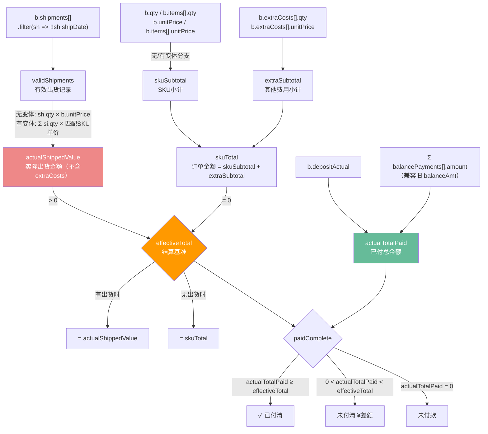
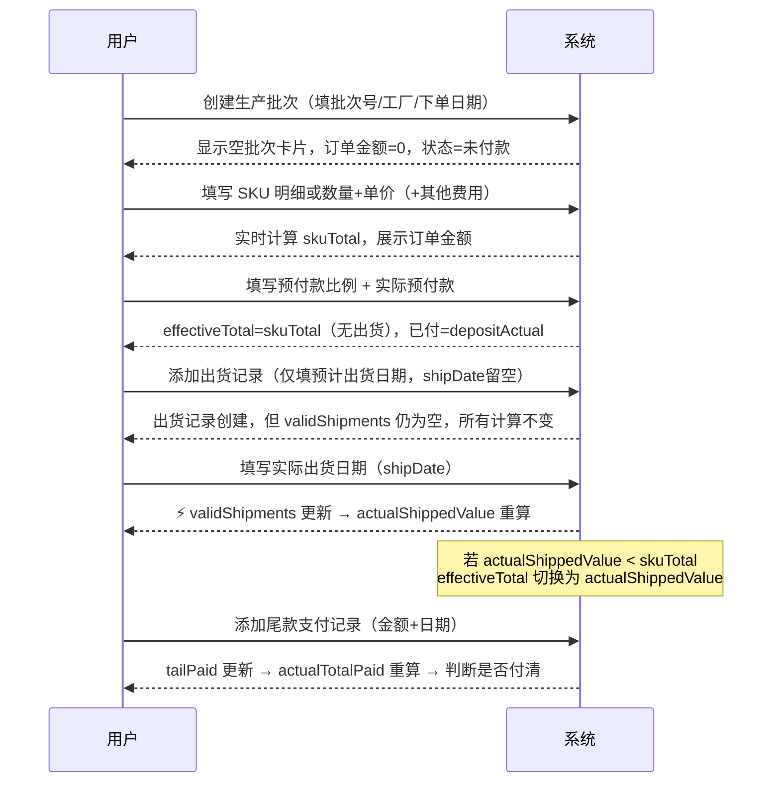
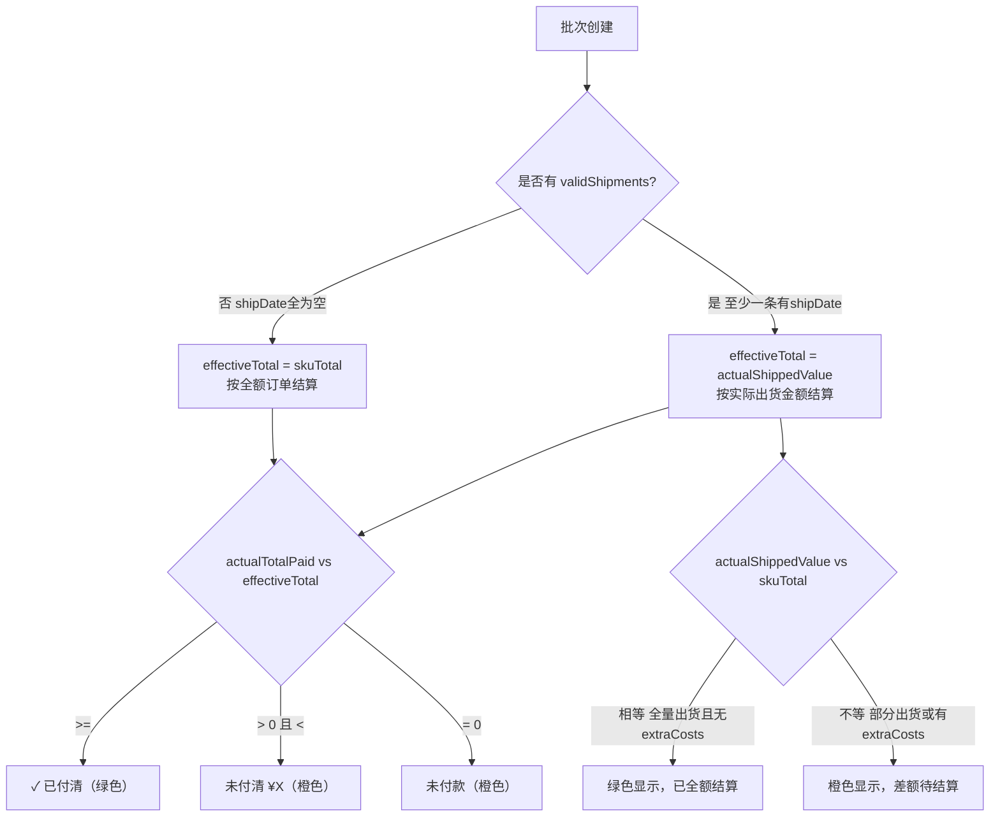
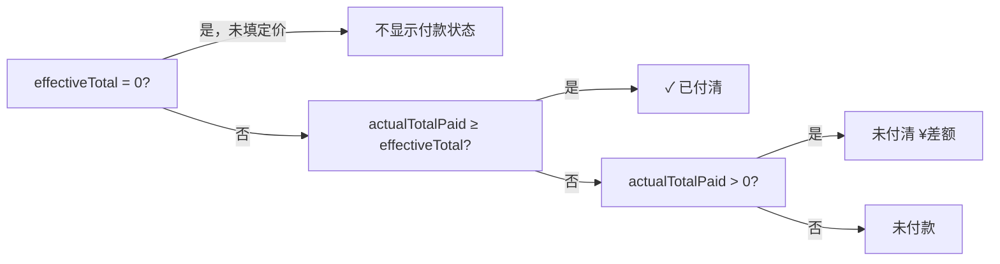

# 生产出货模块 — 技术深度文档

> **适用范围**：`生产出货` Tab → `下单生产` 阶段（STAGES[9]）  
> **核心文件**：`src/features/detail/index.tsx` → `TabProd` 组件（约 408-930 行）  
> **状态管理**：`src/context/ProductContext.tsx` → 9 个专用 update 函数  
> **数据持久化**：SQLite `products` 表 JSON blob，经由 PUT `/api/products` 乐观锁同步

---

## 1. 模块定位

生产出货是整个 FBA 开发流程中**数据结构最复杂、计算链最深**的模块。它承载了从工厂下单到货物到达 FBA 仓库之间的完整资金流和物流流追踪，核心目标是回答三个问题：

1. **钱付了多少？** — 定金 + 尾款多笔支付的实际总额
2. **货发了多少？** — 已填实际出货日期的出货记录对应数量
3. **账结清了吗？** — 实际已付 vs 应结金额（含出货后的动态切换）

---

## 2. 数据模型

### 2.1 数据层次结构

```
Product
└── stages.production: StageData
    ├── status / startDate / endDate     ← 阶段级字段
    └── batches: Batch[]                 ← 生产批次列表

Batch
├── id / batchNo / factory
├── orderDate / expectedShip
├── qty / unitPrice                      ← 无变体时使用
├── depositPct / depositActual / depositDate
├── balancePct / balanceAmt* / balanceDate*   ← *旧字段，已被 balancePayments 替代
├── note / status
├── items: BatchItem[]                   ← SKU 明细（有变体时使用）
├── extraCosts: ExtraCost[]              ← 其他费用
├── shipments: Shipment[]                ← 出货记录
└── balancePayments: BalancePayment[]    ← 尾款支付记录（多笔）

BatchItem
└── id / variantId / variantName / qty / unitPrice

ExtraCost
└── id / name / qty / unitPrice

Shipment
├── id / status
├── expectedShip / shipDate              ← ⚠️ shipDate 是"生效开关"
├── qty                                  ← 无变体时使用
├── items: ShipmentItem[]                ← 有变体时使用
├── method / carrier / tracking
├── fbaShipId / etaDate / note
└── items[]: { id, variantId, variantName, qty }

BalancePayment
└── id / amount / date / shipmentRef / note
```

### 2.2 关键字段说明

| 字段 | 类型 | 说明 | 注意事项 |
|---|---|---|---|
| `b.qty` | number | 无变体时的总下单数量 | 有变体时此字段无效，用 `items[].qty` 之和 |
| `b.unitPrice` | number | 无变体时的单价 | 有变体时此字段无效，各 SKU 有独立单价 |
| `b.depositPct` | number | 预付款比例 (%) | 用于计算理论预付款，不影响实付判断 |
| `b.depositActual` | number | **实际**支付的预付款金额 | 影响 `actualTotalPaid` 和 `paidComplete` |
| `b.balancePct` | number | 尾款比例 (%) | 若未填则自动补为 `max(0, 100 - depositPct)` |
| `b.balancePayments[]` | array | 多笔尾款记录 | 优先于旧字段 `balanceAmt`/`balanceDate` |
| `b.balanceAmt` | number | **已废弃**，旧版单笔尾款 | 仅在 `balancePayments` 为空时作兜底 |
| `sh.shipDate` | string | **实际出货日期** | 这是整个模块最关键的字段，见第 4 节不变量 |
| `sh.expectedShip` | string | 计划出货日期 | 仅展示用，不影响任何计算 |
| `bp.shipmentRef` | string | 关联的出货记录 id | 仅记录用，当前未参与计算逻辑 |

### 2.3 存储方式

所有生产数据以 JSON blob 存储在 SQLite `products` 表的 `data` 字段中，没有独立的关系表。这意味着：

- **读写是整个产品级别**的，每次修改任意字段都触发完整产品对象的 PUT
- **没有行级锁**，并发编辑依靠乐观锁（`version` 字段）
- 批次、出货记录的 `id` 由前端 `uid()` 生成（时间戳 + 随机数），非数据库自增

---

## 3. 核心计算链

### 3.1 变量依赖关系图



### 3.2 金额计算链（完整公式）

**第一层：订单金额**
```
skuSubtotal  = 有变体 ? Σ(item.qty × item.unitPrice)
                       : b.qty × b.unitPrice

extraSubtotal = Σ(cost.qty × cost.unitPrice)

skuTotal = skuSubtotal + extraSubtotal          ← "订单金额"字段展示值
```

**第二层：实际出货金额**
```
validShipments = b.shipments.filter(sh => !!sh.shipDate)

actualShippedValue（无变体）= Σ validShipments: sh.qty × b.unitPrice
actualShippedValue（有变体）= Σ validShipments: Σ sh.items:
                                si.qty × b.items.find(variantId).unitPrice

⚠️ actualShippedValue 故意不含 extraCosts
```

**第三层：结算基准切换（最关键的逻辑）**
```
effectiveTotal = actualShippedValue > 0 ? actualShippedValue
                                        : skuTotal
```

**第四层：付款核算**
```
effBps = balancePayments.length > 0 ? balancePayments
                                     : balanceAmt > 0 ? [{ amount: balanceAmt }]  ← 旧字段兜底
                                                      : []

tailPaid        = Σ effBps.amount
actualTotalPaid = depositActual + tailPaid

paidComplete    = effectiveTotal > 0 && actualTotalPaid >= effectiveTotal
```

**理论金额（仅展示，不影响付清判断）**
```
theorDeposit = skuTotal × depositPct / 100
```

### 3.3 数量计算链

```
orderQty（无变体）= b.qty
orderQty（有变体）= Σ b.items[].qty

shippedQty（无变体）= Σ validShipments: sh.qty
shippedQty（有变体）= Σ validShipments: Σ sh.items[].qty

pendingQty = orderQty - shippedQty
  pendingQty > 0   → 待出货 N pcs
  pendingQty = 0   → ✓ 全部出货
  pendingQty < 0   → ⚠️ 超出订单数量
```

### 3.4 标题行汇总（跨批次聚合）

```
totalOrderQty  = Σ all batches: orderQty(b)
totalSettlement = Σ all batches: effectiveTotal(b)

skuQtyMap（有变体时）= { variantId → { name, qty: Σ across batches } }
                      → 用于悬浮 tooltip 展示各 SKU 总下单数
```

---

## 4. 业务流程

### 4.1 标准生命周期



### 4.2 effectiveTotal 切换逻辑



### 4.3 付款状态判定树



---

## 5. 关键不变量

> 这三条规则是整个模块的设计基础，违反任何一条都会导致计算错误。

**不变量 1：shipDate 是唯一生效开关**
```
只有 shipDate 非空的出货记录才计入以下所有计算：
- shippedQty（已出货数量）
- actualShippedValue（实际出货金额）
- effectiveTotal（当 > 0 时切换基准）

预先创建的"计划中"出货记录（shipDate 为空）对任何数字均无影响。
```

**不变量 2：actualShippedValue 不含 extraCosts**
```
actualShippedValue = Σ validShipments: 出货数量 × SKU单价

其他费用（代采配件/国内运费等）不随出货记录分摊，
始终体现在 skuTotal 中，不进入 effectiveTotal 的出货分支。

⚠️ 业务影响：如果工厂分批出货，effectiveTotal 会低于 skuTotal，
   差额（其他费用部分）暂无对应的结算金额，需要注意是否符合实际付款协议。
```

**不变量 3：balancePayments 的兼容降级顺序**
```
effBps = balancePayments.length > 0
         ? balancePayments                          ← 优先使用多笔记录
         : balanceAmt > 0
           ? [{ amount: balanceAmt, date: balanceDate }]  ← 旧版单笔兜底
           : []                                     ← 无尾款记录

此逻辑已提取为 `getEffectiveBalancePayments(b)` 辅助函数，两处统一调用。
```

---

## 6. 已知问题

> **状态说明**：✅ 已修复（commit bd30e2f，2026-06-18）/ ⏸ 待处理

### ✅ P1 — `shippedQty` 在同一批次内重复计算（代码质量）

**修复**：出货明细 IIFE 内删除重复的 `const batchTotalQty` 和 `const shippedQty` 声明，直接引用外层闭包中已计算的 `orderQty` 和 `shippedQty`。

---

### ✅ P2 — `tailRemain` 死代码（代码质量）

**修复**：删除 `const tailRemain = theorBalance - tailPaid`，该变量计算后从未被渲染或使用。

---

### ✅ P3 — `balancePayments` 兼容逻辑重复（可维护性）

**修复**：提取 `getEffectiveBalancePayments(b)` 辅助函数（位于 `TabProd` 定义之前），原两处内联逻辑统一替换为函数调用。

---

### ✅ P4 — `theorBalance` 死代码（与 P2 关联）

**修复**：`theorBalance` 仅被 `tailRemain` 引用，随 P2 一并删除。"应结尾款"展示值使用 `max(0, effectiveTotal - depositActual)`，口径已统一。

---

### ✅ P5 — 无定价时付款状态误报"未付款"（用户体验）

**修复**：付款状态 chip 渲染条件由 `effectiveTotal > 0` 加强为 `effectiveTotal > 0 && orderQty > 0`，避免仅有 `extraCosts` 但 SKU 数量未填时误显示橙色"未付款"。

---

### ⏸ P6 — 整个模块零 TypeScript 类型约束（类型安全）

**位置**：`types.ts`、`ProductContext.tsx`、`index.tsx`

`stages: Record<string, any>` 导致 `b`、`sh`、`bp` 等全为 `any`，编译器无法发现：
- 字段名拼写错误（如 `sh.shipdate` vs `sh.shipDate`）
- 数值/字符串混用（如 `b.qty` 有时是 `""` 空字符串）
- 删除字段后引用处未同步更新

**建议**：为生产模块定义专用接口（见第 7 节），优先级可以排在功能稳定后。

---

## 7. 优化建议

### 7.1 代码层面

**✅ 已实施：删除死代码（P2/P4）**：`tailRemain`、`theorBalance` 已删除。

**✅ 已实施：提取兼容函数（P3）**：`getEffectiveBalancePayments(b)` 已提取，两处调用统一。

**✅ 已实施：消除重复计算（P1）**：出货 IIFE 直接复用外层 `orderQty`/`shippedQty`。

**待处理：提取批次计算纯函数**（P6 实施时一并做）

当前批次内 ~15 个计算变量仍散落在 `.map()` 回调里。建议提取为：
```tsx
function computeBatch(b: Batch, hasVariants: boolean, variants: Variant[]) {
  // 返回 { skuSubtotal, skuTotal, effectiveTotal, orderQty,
  //         shippedQty, actualTotalPaid, paidComplete, ... }
}
```
好处：单元测试友好，逻辑一处维护。适合与 P6 类型重构一起完成。

### 7.2 业务逻辑层面

**✅ 已实施：无定价保护（P5）**：付款 chip 加 `orderQty > 0` 条件。

**待讨论：`extraCosts` 的结算归属**

当前其他费用不计入 `actualShippedValue`，需与实际付款协议对齐：

- **方案 A（现状）**：其他费用全额在订单时确认，不随出货分摊
- **方案 B**：按出货比例分摊 → `actualShippedValue += extraSubtotal × (shippedQty / orderQty)`

### 7.3 类型安全（优先级：低，但长期价值高）

建议在 `types.ts` 中补充：

```typescript
interface BatchItem {
  id: string;
  variantId: string;
  variantName: string;
  qty: number;
  unitPrice: number;
}

interface ExtraCost {
  id: string;
  name: string;
  qty: number;
  unitPrice: number;
}

interface ShipmentItem {
  id: string;
  variantId: string;
  variantName: string;
  qty: number;
}

interface Shipment {
  id: string;
  status: string;
  expectedShip: string;
  shipDate: string;          // 核心字段：非空才生效
  qty: number;               // 无变体时
  items: ShipmentItem[];     // 有变体时
  method: string;
  carrier: string;
  tracking: string;
  fbaShipId: string;
  etaDate: string;
  note: string;
}

interface BalancePayment {
  id: string;
  amount: number;
  date: string;
  shipmentRef: string;
  note: string;
}

interface ProductionBatch {
  id: string;
  batchNo: string;
  factory: string;
  orderDate: string;
  expectedShip: string;
  qty: number;
  unitPrice: number;
  depositPct: number;
  depositActual: number;
  depositDate: string;
  balancePct: number;
  balanceAmt?: number;       // 废弃字段，保留兼容
  balanceDate?: string;      // 废弃字段，保留兼容
  status: string;
  note: string;
  items: BatchItem[];
  extraCosts: ExtraCost[];
  shipments: Shipment[];
  balancePayments: BalancePayment[];
}
```

---

## 8. 模块健康度评估

| 维度 | 评分 | 说明 |
|---|---|---|
| 业务逻辑完整性 | ★★★★☆ | 核心流程完整，extraCosts 结算归属有歧义 |
| 代码可维护性 | ★★★☆☆ | 计算逻辑重复、类型全 any、单函数过长 |
| 类型安全 | ★★☆☆☆ | 全模块 any，编译器无保护 |
| 用户体验 | ★★★★☆ | 信息密度高，空批次状态误报是主要问题 |
| 数据一致性 | ★★★★☆ | 乐观锁保证多人协作，单人使用无问题 |

---

*文档生成日期：2026-06-18 | 最后更新：2026-06-18 | P1-P5 修复对应 commit bd30e2f*  
*关联文档：`docs/business-overview.md` §2.2-2.3 / `CLAUDE.md` §已知大文件*
